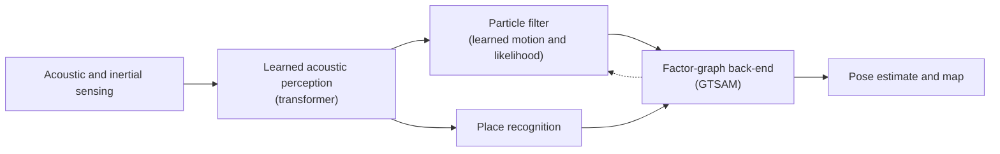

# U-SLAM

  
**Hybrid Transformer + Particle Filter SLAM for Underwater Acoustic Sensing**

U-SLAM is an active research project on localization and mapping for underwater vehicles operating without GPS, in poor visibility, with noisy acoustic sensing. It combines learned acoustic perception, probabilistic filtering, and graph-based optimisation in a single hybrid SLAM system.

## The problem

- **No GPS, degraded vision.** Turbidity and low light make camera-based SLAM unreliable, so acoustic sensing carries the load.
- **Sonar noise is not Gaussian.** Multipath, specular returns, and range artifacts break the assumptions behind classical scan-matching likelihoods.
- **Heterogeneous, asynchronous sonars.** Different sonar types observe the scene with different geometry and timing, and associating them by hand is brittle.
- **Self-similar environments.** Pipelines, trenches, and flat seafloor cause perceptual aliasing, which makes loop closure risky.

## Approach

A three-layer hybrid, with a classical baseline built first so every claim is measured against it.

1. **Learned perception.** A transformer fuses multiple sonar modalities with inertial data, learning cross-sensor association instead of relying on hand-engineered correspondence matching.
2. **Particle filter.** The filter uses learned motion and observation models in place of hand-crafted scoring, so it can represent multi-modal beliefs and non-Gaussian sonar noise.
3. **Factor-graph back-end.** Learned place recognition proposes loop closures, geometric verification filters them, and GTSAM optimises the trajectory globally.

## Research questions

1. Can cross-attention between sonar modalities solve data association without hand-engineered matching?
2. Can a learned observation likelihood let a particle filter work with fewer particles?
3. Can acoustic place embeddings plus geometric verification give reliable loop closure with no visual features?
4. Does end-to-end training through the filter reduce long-horizon drift?

These are hypotheses under investigation, not claimed results.

## Contributions

Framed as adaptations to underwater acoustic sensing:

- Cross-modal sonar fusion via attention, as an implicit data-association mechanism.
- A learned observation likelihood inside a particle filter for sonar.
- Loop closure from learned acoustic place recognition with geometric verification.

## Evaluation

The hybrid is benchmarked against a classical particle-filter SLAM baseline on held-out simulated environments, using absolute and relative trajectory error against ground truth, with ablations isolating each learned component and a documented failure analysis.

<!-- TODO: add a Results section once experiments are complete: trajectory-error table (classical vs hybrid) and a before/after loop-closure figure. -->

## Tech stack

ROS2 Humble · Gazebo · PyTorch · GTSAM · Python

<!-- TODO: add LinkedIn / contact link and a LICENSE file. -->
